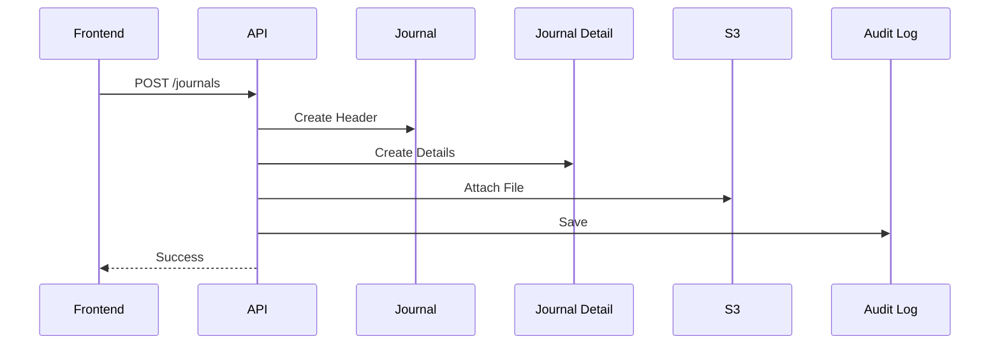
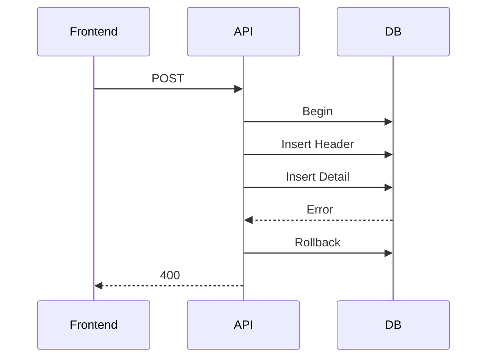

# 05 API設計書

Version: 1.0

---

# 1. 文書情報

## 1.1 目的

本書は、KeiriFlow（クラウド会計システム）のREST API仕様を定義する。

本APIはフロントエンド（Django Template）、将来的なSPA（React / Vue）、および外部サービスとの連携を想定して設計する。

本設計書では以下を定義する。

- API設計方針
- URI設計
- HTTP通信仕様
- Request / Response形式
- 認証方式
- バリデーション
- エラーハンドリング
- REST API一覧

---

## 1.2 対象システム

|項目|内容|
|----|----|
|システム名|KeiriFlow|
|バックエンド|Django 5 + Django REST Framework|
|データベース|PostgreSQL|
|ストレージ|Amazon S3|
|Web Server|Nginx|
|Infrastructure|AWS EC2|
|Container|Docker Compose|
|API形式|REST API|
|データ形式|JSON|
|文字コード|UTF-8|

---

## 1.3 API利用者

本APIは以下の利用者を想定する。

|利用者|内容|
|------|------|
|Web Frontend|Django Template|
|Mobile App|将来対応予定|
|SPA|React / Vue|
|外部システム|Webhook・API連携|

---

## 1.4 REST API設計方針

KeiriFlowではRESTful Architectureを採用する。

基本方針は以下の通り。

- Resource指向
- HTTP Methodを正しく利用
- Stateless
- JSON通信
- HTTPS必須
- URIに動詞を含めない
- Version管理を行う

例

```
GET     /api/v1/users
POST    /api/v1/users
PUT     /api/v1/users/10
DELETE  /api/v1/users/10
```

---

# 2. API基本仕様

## 2.1 Base URL

開発環境

```
http://localhost:8000/api/v1/
```

検証環境

```
https://stg.keiriflow.com/api/v1/
```

本番環境

```
https://api.keiriflow.com/api/v1/
```

---

## 2.2 Protocol

HTTPSのみ許可する。

HTTPアクセスはHTTPSへリダイレクトする。

---

## 2.3 Character Encoding

UTF-8

---

## 2.4 Content-Type

Request

```
Content-Type: application/json
```

Response

```
Content-Type: application/json
```

ファイルアップロード時

```
multipart/form-data
```

---

## 2.5 Time Zone

システム内部

```
UTC
```

表示

```
Asia/Tokyo
```

日時形式

```
2026-07-01T10:30:25Z
```

---

## 2.6 Date Format

日付

```
YYYY-MM-DD
```

日時

```
YYYY-MM-DDTHH:mm:ssZ
```

例

```
2026-07-01
```

```
2026-07-01T13:00:00Z
```

---

# 3. URI設計

## 3.1 URI命名規則

Resourceは複数形を使用する。

○

```
/users
```

```
/accounts
```

```
/journals
```

×

```
/getUsers
```

```
/createJournal
```

```
/deleteInvoice
```

---

## 3.2 Version管理

API VersionをURIに含める。

```
/api/v1/
```

将来的には

```
/api/v2/
```

への移行を想定する。

---

## 3.3 ネスト構造

必要最低限のみネストする。

例

```
/invoices/15/pdf
```

```
/invoices/15/send
```

---

## 3.4 Query Parameter

検索

```
GET /journals?keyword=Amazon
```

日付

```
GET /journals?from=2026-01-01&to=2026-12-31
```

ページング

```
?page=1&page_size=20
```

ソート

```
?ordering=-created_at
```

---

# 4. HTTP Method設計

|Method|用途|
|------|------|
|GET|取得|
|POST|新規登録|
|PUT|更新|
|PATCH|一部更新|
|DELETE|削除|

---

## 4.1 GET

データ取得のみ。

例

```
GET /users
```

---

## 4.2 POST

新規作成。

例

```
POST /journals
```

---

## 4.3 PUT

全項目更新。

```
PUT /users/3
```

---

## 4.4 PATCH

一部のみ更新。

```
PATCH /users/3
```

例

```json
{
    "email": "new@test.com"
}
```

---

## 4.5 DELETE

論理削除を基本とする。

```
DELETE /partners/5
```

DBではdeleted_atを更新する。

---

# 5. 共通Request仕様

## 5.1 Request Header

```http
Content-Type: application/json
Accept: application/json
```

認証後

```http
Cookie: sessionid=xxxxxxxxxxxx
```

CSRF

```http
X-CSRFToken: xxxxxxxxxxxxxx
```

---

## 5.2 Request Body

JSON形式とする。

例

```json
{
    "company_name": "株式会社ABC",
    "postal_code": "1000001",
    "phone": "0312345678"
}
```

---

## 5.3 Pagination

一覧APIはPaginationを採用する。

Request

```
?page=1&page_size=20
```

Response

```json
{
    "count": 135,
    "next": "/api/v1/users?page=2",
    "previous": null,
    "results": []
}
```

---

## 5.4 Sort

```
?ordering=name
```

降順

```
?ordering=-created_at
```

複数

```
?ordering=company_name,-created_at
```

---

## 5.5 Filter

例

```
GET /invoices?status=PAID
```

```
GET /journals?account_id=10
```

```
GET /partners?keyword=Amazon
```

```
GET /journals?from=2026-01-01&to=2026-03-31
```

---

# 6. 共通Response仕様

## 6.1 Success

```json
{
    "success": true,
    "message": "",
    "data": {}
}
```

---

## 6.2 List

```json
{
    "success": true,
    "data": {
        "count": 200,
        "next": "...",
        "previous": null,
        "results": []
    }
}
```

---

## 6.3 Validation Error

HTTP

```
400 Bad Request
```

Response

```json
{
    "success": false,
    "message": "Validation Error",
    "errors": {
        "company_name": [
            "必須項目です。"
        ]
    }
}
```

---

## 6.4 Unauthorized

```
401 Unauthorized
```

```json
{
    "detail": "Authentication credentials were not provided."
}
```

---

## 6.5 Permission Error

```
403 Forbidden
```

```json
{
    "detail": "Permission denied."
}
```

---

## 6.6 Not Found

```
404 Not Found
```

```json
{
    "detail": "Not found."
}
```

---

## 6.7 Internal Server Error

```
500 Internal Server Error
```

```json
{
    "success": false,
    "message": "Unexpected Server Error"
}
```

---

# 7. HTTP Status一覧

|Status|説明|
|-------|------|
|200|正常終了|
|201|登録成功|
|204|削除成功|
|400|入力エラー|
|401|未認証|
|403|権限不足|
|404|存在しない|
|405|Method不正|
|409|重複データ|
|422|業務エラー|
|500|システムエラー|

---

# 8. API設計ルール

API実装時は以下のルールを遵守する。

- RESTful設計を採用する。
- URLに動詞を含めない。
- JSON形式で統一する。
- 一覧APIは必ずページング対応とする。
- 更新日時(created_at / updated_at)を返却する。
- UUIDではなく内部IDを利用する（将来変更可能）。
- 論理削除を基本とする。
- エラーコードを統一する。
- テナント間のデータ参照は禁止する。
- API Versionを維持する。
- OpenAPI（Swagger）を自動生成する。

---

Part1 完了

次章（Part2）では以下のAPIを設計する。

- 認証API
- ユーザーAPI
- テナントAPI
- 会社API

---

# 9. 認証API

---

## 9.1 ログイン

### 概要

ユーザー認証を行い、セッションを生成する。

---

### API情報

|項目|内容|
|----|----|
|Method|POST|
|URI|/api/v1/auth/login|
|認証|不要|
|権限|不要|

---

### Request

```json
{
    "email": "admin@example.com",
    "password": "password123"
}
```

---

### Validation

|項目|必須|備考|
|----|----|----|
|email|〇|メール形式|
|password|〇|8文字以上|

---

### Response

```json
{
    "success": true,
    "message": "Login Success",
    "data": {
        "id": 1,
        "name": "Administrator",
        "email": "admin@example.com",
        "role": "ADMIN"
    }
}
```

---

### Error

|HTTP|内容|
|----|----|
|400|入力エラー|
|401|メールアドレスまたはパスワード不正|

---

### 業務ルール

- Session Authenticationを利用する
- Login成功時にSession Cookieを発行する
- Passwordはレスポンスへ返却しない

---

## 9.2 ログアウト

### API情報

|項目|内容|
|----|----|
|Method|POST|
|URI|/api/v1/auth/logout|
|認証|必要|

---

### Response

```json
{
    "success": true,
    "message": "Logout Success"
}
```

---

### 業務ルール

- Session削除
- CSRF Token無効化

---

## 9.3 ログインユーザー取得

### API情報

|項目|内容|
|----|----|
|Method|GET|
|URI|/api/v1/auth/me|
|認証|必要|

---

### Response

```json
{
    "success": true,
    "data": {
        "id": 1,
        "name": "Administrator",
        "email": "admin@example.com",
        "company_id": 1,
        "role": "ADMIN"
    }
}
```

---

## 9.4 パスワード変更

### API情報

|項目|内容|
|----|----|
|Method|POST|
|URI|/api/v1/auth/change-password|

---

### Request

```json
{
    "current_password":"******",
    "new_password":"******"
}
```

---

### Validation

- 現在パスワード一致
- 新パスワード8文字以上

---

# 10. ユーザーAPI

---

## 10.1 一覧取得

### API情報

|項目|内容|
|----|----|
|Method|GET|
|URI|/api/v1/users|
|認証|必要|
|権限|Admin|

---

### Query Parameter

|項目|型|説明|
|----|----|----|
|page|int|ページ|
|page_size|int|件数|
|keyword|string|検索|

---

### Response

```json
{
    "success": true,
    "data": {
        "count": 2,
        "results": [
            {
                "id": 1,
                "name": "Administrator",
                "email": "admin@test.com",
                "role": "ADMIN",
                "is_active": true
            }
        ]
    }
}
```

---

## 10.2 詳細取得

GET

```
/api/v1/users/{id}
```

---

### Response

```json
{
    "success": true,
    "data": {
        "id": 3,
        "name": "Suzuki",
        "email": "suzuki@test.com",
        "role": "ACCOUNTANT"
    }
}
```

---

## 10.3 登録

POST

```
/api/v1/users
```

---

### Request

```json
{
    "name":"Suzuki",
    "email":"suzuki@test.com",
    "password":"Password123",
    "role":"ACCOUNTANT"
}
```

---

### Validation

|項目|内容|
|----|----|
|name|必須|
|email|重複不可|
|password|8文字以上|
|role|マスタ存在確認|

---

### Response

```json
{
    "success": true,
    "message": "User Created"
}
```

---

## 10.4 更新

PUT

```
/api/v1/users/{id}
```

---

### Request

```json
{
    "name":"New Name",
    "role":"VIEWER"
}
```

---

## 10.5 削除

DELETE

```
/api/v1/users/{id}
```

---

### 業務ルール

- 論理削除
- 自分自身は削除不可

---

# 11. テナントAPI

KeiriFlowはマルチテナント方式を採用する。

Tenant単位でデータを完全分離する。

---

## 11.1 テナント情報取得

GET

```
/api/v1/tenant
```

---

### Response

```json
{
    "success": true,
    "data": {
        "id":1,
        "tenant_name":"ABC合同会社",
        "plan":"STANDARD",
        "user_limit":10
    }
}
```

---

## 11.2 プラン変更

PUT

```
/api/v1/tenant/plan
```

---

### Request

```json
{
    "plan":"PREMIUM"
}
```

---

### 業務ルール

管理者のみ変更可能。

---

# 12. 会社API

---

## 12.1 会社情報取得

GET

```
/api/v1/company
```

---

### Response

```json
{
    "success": true,
    "data": {
        "company_name":"ABC合同会社",
        "postal_code":"1000001",
        "address":"東京都千代田区",
        "phone":"0312345678",
        "invoice_number":"T1234567890123"
    }
}
```

---

## 12.2 更新

PUT

```
/api/v1/company
```

---

### Request

```json
{
    "company_name":"ABC合同会社",
    "postal_code":"1000001",
    "address":"東京都千代田区",
    "phone":"0312345678",
    "invoice_number":"T1234567890123"
}
```

---

### Validation

|項目|内容|
|----|----|
|会社名|必須|
|郵便番号|7桁|
|電話番号|20文字以内|
|インボイス番号|T＋13桁|

---

### Response

```json
{
    "success": true,
    "message": "Company Updated"
}
```

---

# 13. 共通権限

|API|Admin|Accountant|Viewer|
|----|:----:|:----:|:----:|
|Login|〇|〇|〇|
|Logout|〇|〇|〇|
|User List|〇|-|-|
|User Create|〇|-|-|
|User Update|〇|-|-|
|User Delete|〇|-|-|
|Company View|〇|〇|〇|
|Company Update|〇|〇|-|
|Tenant View|〇|-|-|
|Tenant Update|〇|-|-|

---

# 14. 共通バリデーション

|項目|ルール|
|----|------|
|Email|RFC準拠|
|Password|8〜64文字|
|Phone|半角数字|
|Postal Code|7桁|
|Invoice Number|T+13桁|
|Name|100文字以内|

---

# 13. 勘定科目API（Account API）

## 13.1 概要

勘定科目マスタを管理するAPIである。

仕訳入力、請求書、決算書など全ての会計機能から参照される。

論理削除方式を採用する。

---

## 13.2 一覧取得

|項目|内容|
|----|----|
|Method|GET|
|URI|/api/v1/accounts|
|認証|必要|
|権限|Admin / Accountant / Viewer|

### Query Parameter

|項目|型|説明|
|----|----|----|
|keyword|string|科目名検索|
|category|string|資産・負債など|
|is_active|boolean|有効のみ|

### Response

```json
{
    "success": true,
    "data": {
        "count": 3,
        "results": [
            {
                "id": 1,
                "code": "1110",
                "name": "普通預金",
                "category": "ASSET",
                "tax_type": "NON_TAXABLE",
                "is_active": true
            }
        ]
    }
}
```

---

## 13.3 詳細取得

GET

```
/api/v1/accounts/{id}
```

---

## 13.4 新規登録

POST

```
/api/v1/accounts
```

Request

```json
{
    "code":"6110",
    "name":"旅費交通費",
    "category":"EXPENSE",
    "tax_type":"TAXABLE10"
}
```

Validation

|項目|内容|
|----|----|
|code|必須・重複不可|
|name|必須|
|category|マスタ存在確認|
|tax_type|マスタ存在確認|

---

## 13.5 更新

PUT

```
/api/v1/accounts/{id}
```

---

## 13.6 削除

DELETE

```
/api/v1/accounts/{id}
```

### 業務ルール

- 使用中の勘定科目は削除不可
- 論理削除を行う
- システム標準科目は削除不可

---

# 14. 補助科目API（Sub Account API）

## 14.1 概要

補助科目を管理する。

補助科目は勘定科目配下に属する。

例

```
売掛金
 ├─ Amazon
 ├─ 楽天
 └─ Yahoo
```

---

## 14.2 一覧取得

GET

```
/api/v1/sub-accounts
```

Query

|項目|説明|
|----|----|
|account_id|勘定科目|
|keyword|名称|

---

### Response

```json
{
    "success": true,
    "data": [
        {
            "id": 10,
            "account_id": 1,
            "name": "Amazon"
        }
    ]
}
```

---

## 14.3 登録

POST

```
/api/v1/sub-accounts
```

Request

```json
{
    "account_id":1,
    "name":"楽天"
}
```

---

## 14.4 更新

PUT

```
/api/v1/sub-accounts/{id}
```

---

## 14.5 削除

DELETE

```
/api/v1/sub-accounts/{id}
```

---

### 業務ルール

- 勘定科目削除時は補助科目も利用不可
- 使用中データは削除不可

---

# 15. 取引先API（Partner API）

## 15.1 概要

得意先・仕入先・外注先を管理する。

請求書、仕訳、入金管理から参照される。

---

## 15.2 一覧取得

GET

```
/api/v1/partners
```

Query

|項目|説明|
|----|----|
|keyword|検索|
|partner_type|CUSTOMER / SUPPLIER|

---

### Response

```json
{
    "success": true,
    "data": {
        "count": 2,
        "results": [
            {
                "id": 1,
                "company_name": "株式会社ABC",
                "partner_type": "CUSTOMER",
                "invoice_number": "T1234567890123"
            }
        ]
    }
}
```

---

## 15.3 詳細取得

GET

```
/api/v1/partners/{id}
```

---

## 15.4 登録

POST

```
/api/v1/partners
```

Request

```json
{
    "company_name":"株式会社ABC",
    "partner_type":"CUSTOMER",
    "postal_code":"1000001",
    "address":"東京都千代田区",
    "phone":"0312345678",
    "email":"info@test.co.jp",
    "invoice_number":"T1234567890123"
}
```

---

Validation

|項目|内容|
|----|----|
|会社名|必須|
|Email|形式|
|電話番号|20文字以内|
|Invoice Number|T+13桁|

---

## 15.5 更新

PUT

```
/api/v1/partners/{id}
```

---

## 15.6 削除

DELETE

```
/api/v1/partners/{id}
```

---

### 業務ルール

- 仕訳で使用済みの場合削除不可
- 論理削除を行う

---

# 16. 消費税API（Tax API）

## 16.1 概要

消費税区分マスタを取得する。

税率変更に対応可能な設計とする。

---

## 16.2 一覧取得

GET

```
/api/v1/taxes
```

---

### Response

```json
{
    "success": true,
    "data": [
        {
            "id":1,
            "name":"課税10%",
            "rate":10.0
        },
        {
            "id":2,
            "name":"軽減税率8%",
            "rate":8.0
        },
        {
            "id":3,
            "name":"非課税",
            "rate":0
        }
    ]
}
```

---

### 業務ルール

- システムマスタ
- 一般ユーザーは更新不可

---

# 17. 部門API（Department API）

## 17.1 概要

部門別会計に利用する。

将来的に管理会計へ対応する。

---

## 17.2 一覧取得

GET

```
/api/v1/departments
```

---

### Response

```json
{
    "success": true,
    "data": [
        {
            "id":1,
            "code":"D001",
            "name":"営業部"
        },
        {
            "id":2,
            "code":"D002",
            "name":"開発部"
        }
    ]
}
```

---

## 17.3 登録

POST

```
/api/v1/departments
```

---

## 17.4 更新

PUT

```
/api/v1/departments/{id}
```

---

## 17.5 削除

DELETE

```
/api/v1/departments/{id}
```

---

### 業務ルール

- 使用中部門は削除不可
- 論理削除を採用

---

# 18. マスタAPI共通仕様

## 共通バリデーション

|項目|内容|
|----|----|
|Code|重複不可|
|Name|必須・100文字以内|
|Category|マスタ存在確認|
|Tax Type|マスタ存在確認|

---

## 共通レスポンス

登録成功

```json
{
    "success": true,
    "message": "Created Successfully"
}
```

更新成功

```json
{
    "success": true,
    "message": "Updated Successfully"
}
```

削除成功

```json
{
    "success": true,
    "message": "Deleted Successfully"
}
```

---

# 19. 仕訳API（Journal API）

## 19.1 概要

仕訳APIはKeiriFlowにおける中核機能である。

複式簿記のルールに基づき、一つの仕訳（Journal Header）と複数の仕訳明細（Journal Details）を同時に登録する。

登録処理は単一トランザクションで実行し、ヘッダー・明細のいずれかが失敗した場合はロールバックする。

---

## 19.2 データ構成

```

Journal(Header)
│
├── Journal Detail (Debit)
├── Journal Detail (Credit)
├── Journal Detail
└── Attachment

```

---

## 19.3 ステータス

|Status|説明|
|-------|------|
|DRAFT|下書き|
|APPROVED|承認済み|
|POSTED|確定|
|CANCELLED|取消|

---

## 19.4 一覧取得

|項目|内容|
|----|----|
|Method|GET|
|URI|/api/v1/journals|

### Query Parameter

|項目|内容|
|----|------|
|from|開始日|
|to|終了日|
|status|状態|
|partner_id|取引先|
|account_id|勘定科目|
|keyword|摘要|

---

### Response

```json
{
  "success": true,
  "data": {
    "count": 1,
    "results": [
      {
        "id": 15,
        "journal_no": "JR2026070001",
        "journal_date": "2026-07-05",
        "status": "POSTED",
        "description": "PC購入",
        "amount": 150000
      }
    ]
  }
}
```

---

## 19.5 詳細取得

GET

```
/api/v1/journals/{id}
```

---

### Response

```json
{
  "success": true,
  "data": {
    "id":15,
    "journal_no":"JR2026070001",
    "journal_date":"2026-07-05",
    "status":"POSTED",
    "details":[
      {
        "account":"消耗品費",
        "debit":150000,
        "credit":0
      },
      {
        "account":"普通預金",
        "debit":0,
        "credit":150000
      }
    ]
  }
}
```

---

## 19.6 新規登録

POST

```
/api/v1/journals
```

---

### Request

```json
{
  "journal_date":"2026-07-05",
  "description":"ノートPC購入",
  "partner_id":3,
  "details":[
    {
      "account_id":18,
      "tax_id":1,
      "department_id":2,
      "debit":150000,
      "credit":0
    },
    {
      "account_id":2,
      "tax_id":3,
      "department_id":2,
      "debit":0,
      "credit":150000
    }
  ]
}
```

---

### バリデーション

|項目|内容|
|----|----|
|journal_date|必須|
|details|2件以上|
|借方合計|貸方合計と一致|
|勘定科目|存在確認|
|消費税|存在確認|

---

### 業務ルール

- 借方合計＝貸方合計
- 明細は最低2行
- Journal Header と Detail を同時保存
- DB Transactionを使用
- Audit Log記録

---

## 19.7 更新

PUT

```
/api/v1/journals/{id}
```

更新可能状態

- DRAFT

更新不可

- POSTED
- CANCELLED

---

## 19.8 削除

DELETE

```
/api/v1/journals/{id}
```

論理削除を採用する。

POSTEDデータは削除不可。

---

## 19.9 承認

POST

```
/api/v1/journals/{id}/approve
```

状態

```
DRAFT

↓

APPROVED
```

---

## 19.10 確定

POST

```
/api/v1/journals/{id}/post
```

状態

```
APPROVED

↓

POSTED
```

POSTED後は編集不可。

---

# 20. トランザクション設計

仕訳登録は単一Transactionで実行する。

```
BEGIN

Insert Journal

Insert Details

Update Attachment

Commit

```

失敗

```
Rollback

```

---

# 21. 楽観ロック

更新時はupdated_atを比較する。

Request

```json
{
  "updated_at":"2026-07-05T09:00:00Z"
}
```

一致しない場合

```
409 Conflict
```

---

# 22. 添付ファイルAPI

## 22.1 一覧

GET

```
/api/v1/files
```

---

## 22.2 Upload

POST

```
/api/v1/files
```

Content-Type

```
multipart/form-data
```

保存先

Amazon S3

---

Response

```json
{
  "success":true,
  "data":{
    "id":10,
    "file_name":"receipt.pdf",
    "url":"..."
  }
}
```

---

## 22.3 Download

GET

```
/api/v1/files/{id}
```

---

## 22.4 Delete

DELETE

```
/api/v1/files/{id}
```

---

### 業務ルール

- PDF
- JPG
- PNG

最大20MB

---

# 23. ダッシュボードAPI

## 23.1 概要

トップ画面表示用API

---

GET

```
/api/v1/dashboard
```

---

Response

```json
{
  "success":true,
  "data":{
    "sales":1200000,
    "expense":550000,
    "profit":650000,
    "unpaid_invoice":5,
    "unreceived_payment":3
  }
}
```

---

取得内容

- 売上
- 費用
- 利益
- 未払請求書
- 未入金請求書

---

# 24. APIシーケンス

## 仕訳登録



---

## エラー時



---

# 25. 請求書API（Invoice API）

## 25.1 概要

請求書の作成・更新・参照・削除を行うAPIである。

請求書は取引先情報および請求明細から構成される。

PDF生成およびメール送信機能と連携する。

---

## 25.2 一覧取得

|項目|内容|
|----|----|
|Method|GET|
|URI|/api/v1/invoices|
|認証|必要|
|権限|Admin / Accountant / Viewer|

### Query Parameter

|項目|説明|
|----|----|
|status|請求書状態|
|partner_id|取引先|
|from|請求日開始|
|to|請求日終了|
|keyword|請求番号・会社名|

---

### Response

```json
{
  "success": true,
  "data": {
    "count": 2,
    "results": [
      {
        "id": 1,
        "invoice_no": "INV-202607-0001",
        "partner_name": "株式会社ABC",
        "invoice_date": "2026-07-01",
        "due_date": "2026-07-31",
        "status": "SENT",
        "total_amount": 550000
      }
    ]
  }
}
```

---

## 25.3 詳細取得

GET

```
/api/v1/invoices/{id}
```

---

## 25.4 登録

POST

```
/api/v1/invoices
```

### Request

```json
{
  "partner_id": 5,
  "invoice_date": "2026-07-01",
  "due_date": "2026-07-31",
  "subject": "2026年7月分 システム開発",
  "details": [
    {
      "description": "システム開発",
      "quantity": 1,
      "unit_price": 500000,
      "tax_rate": 10
    }
  ]
}
```

---

### バリデーション

|項目|内容|
|----|----|
|partner_id|必須|
|invoice_date|必須|
|due_date|請求日以降|
|details|1件以上|

---

## 25.5 更新

PUT

```
/api/v1/invoices/{id}
```

---

## 25.6 削除

DELETE

```
/api/v1/invoices/{id}
```

### 業務ルール

- 論理削除を採用する
- 入金済み請求書は削除不可

---

# 26. PDF生成API

## PDF生成

POST

```
/api/v1/invoices/{id}/pdf
```

### Response

```json
{
  "success": true,
  "data": {
    "download_url": "https://..."
  }
}
```

---

### 業務ルール

- PDFはAmazon S3へ保存
- ファイル名は一意とする
- 再生成時は新しいバージョンを保存する

---

# 27. メール送信API

## メール送信

POST

```
/api/v1/invoices/{id}/send
```

### Request

```json
{
  "to": [
    "customer@example.com"
  ],
  "cc": [],
  "bcc": [],
  "subject": "請求書送付",
  "message": "請求書を送付いたします。"
}
```

---

### Response

```json
{
  "success": true,
  "message": "Mail Sent"
}
```

---

### 業務ルール

- PDFを添付する
- 送信履歴を保存する
- 送信失敗時はログへ記録する

---

# 28. エラーコード一覧

|Code|HTTP|内容|
|----|----|----|
|AUTH001|401|認証失敗|
|AUTH002|403|権限不足|
|USER001|400|ユーザー存在しない|
|COMP001|400|会社情報未登録|
|ACC001|400|勘定科目存在しない|
|PART001|400|取引先存在しない|
|JRN001|400|借方貸方不一致|
|JRN002|409|仕訳更新競合|
|INV001|400|請求書存在しない|
|FILE001|400|ファイル形式不正|
|SYS001|500|予期しないエラー|

---

# 29. OpenAPI（Swagger）

## 目的

REST API仕様を自動生成する。

利用ライブラリ

```
drf-spectacular
```

URL

```
/api/schema/
```

Swagger UI

```
/api/docs/
```

Redoc

```
/api/redoc/
```

---

# 30. セキュリティ設計

## 認証

- Django Session Authentication
- HTTPS必須
- CSRF Protection

---

## 認可

Role Based Access Control（RBAC）

- Admin
- Accountant
- Viewer

---

## テナント分離

全APIは tenant_id を条件としてデータを取得する。

異なるテナントのデータへアクセスしてはならない。

---

## SQL Injection

ORM（Django ORM）を利用する。

Raw SQLは禁止する。

---

## XSS

画面表示時にHTML Escapeを実施する。

---

## Rate Limit

DRF Throttlingを利用する。

例

|API|制限|
|----|----|
|Login|5回/分|
|General API|100回/分|

---

## Password

保存方式

```
PBKDF2
```

平文保存は禁止。

---

# 31. Audit Log

監査対象

- Login
- Logout
- User Update
- Journal Create
- Journal Update
- Invoice Send
- Permission Change

保存内容

|項目|内容|
|----|----|
|User|実行ユーザー|
|Tenant|会社|
|API|URI|
|Method|HTTP Method|
|IP|接続元|
|Result|Success / Error|
|Created At|実行日時|

---

# 32. API Version管理

VersionはURIで管理する。

```
/api/v1/
```

将来

```
/api/v2/
```

を追加する。

v1は一定期間互換性を維持する。

---

# 33. 非同期処理

大量処理は同期APIを使用しない。

対象

- PDF生成
- メール送信
- CSV Export
- バックアップ

利用技術

```
Celery
Redis
```

---

# 34. 将来拡張

今後追加予定

- JWT Authentication
- OAuth2
- API Token
- Webhook
- GraphQL
- Multi Language
- Mobile API
- AI仕訳提案
- 電子帳簿保存法対応
- インボイス制度拡張

---

# 35. API一覧

|分類|API数|
|------|------:|
|認証API|4|
|ユーザーAPI|5|
|テナントAPI|2|
|会社API|2|
|勘定科目API|5|
|補助科目API|5|
|取引先API|5|
|消費税API|1|
|部門API|5|
|仕訳API|7|
|添付ファイルAPI|4|
|ダッシュボードAPI|1|
|請求書API|6|
|PDF API|1|
|メールAPI|1|

**合計：約54エンドポイント**

---

# 改訂履歴

|Version|日付|内容|作成者|
|--------|----------|--------------------------|--------|
|1.0|2026-07-05|初版作成|GRS合同会社|